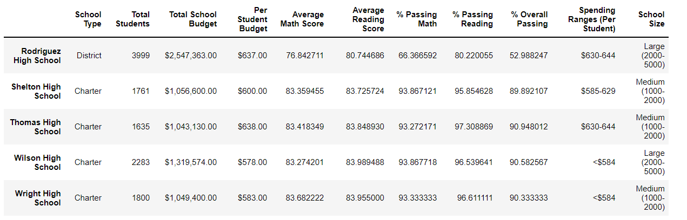
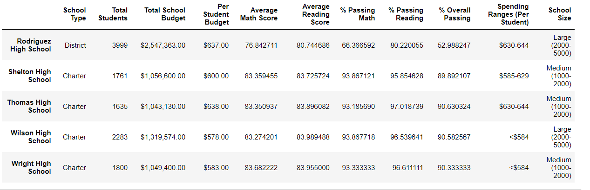
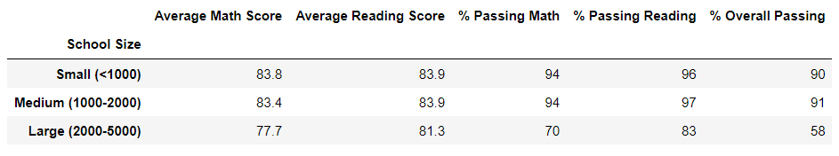
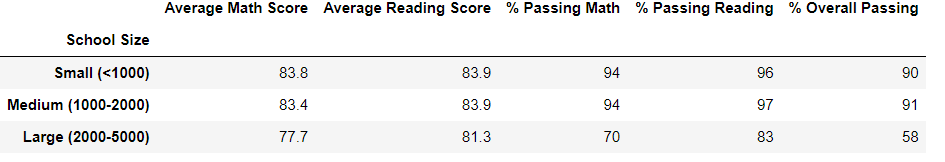
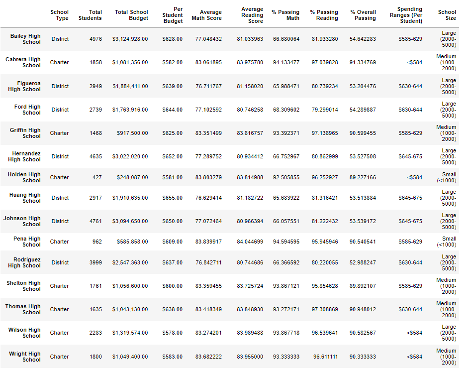

# ***School District Analysis***

## **OVERVIEW OF THE SCHOOL DISCTRICT ANALYSIS:**
------------------------------------------------
The purpose of this project was to analyze the testing scores for math and reading in the school district. This analysis observed the following metrics: 
    
        -the math and reading scores for each school
        -the spending budget per school
        -the size of each school
        -the type of each school (District or Charter)

We were also tasked with omitting the 9th grade Thomas High School results due to academic dishonesty and to analyze the different results pre and post omission. 

With this analysis, one could deduce the correlation between each of these metrics and a student's abilities in math and reading. District officials can then make informed budgetary or academic decisions for future school years. 

## **RESULTS:**
---------------

### ***How does replacing Thomas High's ninth grade math and reading scores affect their performance in comparison to other schools?***

Please observe the following: 

**Thomas High Results Including Ninth Grade Students:**

**Thomas High Results Without Ninth Grade Students:**

From the results above, one can conclude that there was a 0.32% difference in the overall passing percent for Thomas High. Although there were 461 students in the ninth grade whose scores were omitted, there was not a huge impact on the overall scores for the whole school. We can attribute this to the carried weight of the scores from the 10th through 12th grades. 

### ***How is the district summary affected?***

Please observe the following: 

**Overall Passing Percent Including Thomas High Ninth Grade:**

**Overall Passing Percent Without Thomas High Ninth Grade:**

The results above clearly state that the small percent of change in the Thomas High overall passing percent had no effect on the average scores for the entire district. 

### ***How is the school summary affected?***

Please observe the following: 

**Total Summary Including Thomas High Ninth Grade:**

**Total Summary Without Thomas High Ninth Grade:**

Upon close observation of the two total summary charts, one could come to a reasonable conclusion that Thomas High School's high test scores are likely due to the size (medium population), budget ($630-644 per student), and type (Charter). Even with the omission of the ninth grade, Thomas High still saw overall even success rates in each grade. Similar schools saw almost replicated successes, such as Shelton High School. Other schools with larger populations, district types, in yet similar budgets per student saw lower test scores, so adjustments would be needed by the district authorities to increase their success rates. 
Additionally, there may be other factors affecting the test scores in the district that are uncontrollable by district authorities, such as student household income and neighborhood. These areas might require more data analysis to reach a conclusion for students per high school. 

### ***How does replacing the ninth-grade scores at Thomas High affect the following:***

-Math and reading scores by grade:

Since the average passing scores for all of the grades at Thomas High were about the same, (about 83-84% for math and reading) the omission of the ninth grade results was minimal. 
       
-Scores by school spending:

There was little effect on the overall analysis of the school spending per student with the omission of the ninth grade. 
        
-Scores by school size:

The analysis was unaffected by the omission of the Thomas High ninth graders, as their population remained the same. 

-Scores by school type:

The analysis was unaffected by the omission of the Thomas High ninth graders, as the school type remained the same. 

## **SUMMARY**
---------------
The four major changes that were observed with the omission of Thomas High's ninth grade scores were solely found in Thomas High. Their average math scores, reading scores, math percent passing, and reading percent passing all saw slight decreases. The overall percentage passing saw a decrease in 0.32%. This minimal effect, however, was not significant enough to effect the overall percentages for the whole school district. 

 